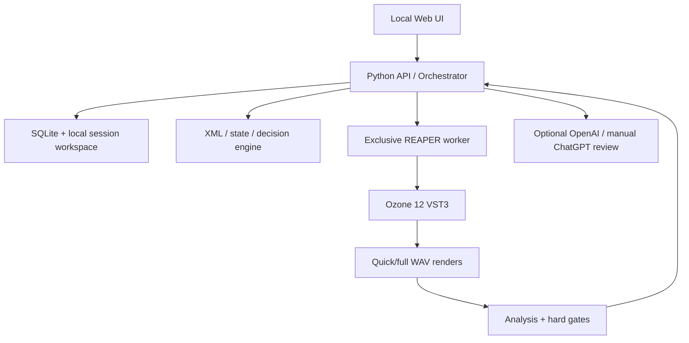

# Runtime Architecture v1

Статус: **ACTIVE / APPROVED**  
Дата фиксации: 2026-08-18

## 1. Назначение и граница

`OZONE12_MASTERING_LAB` — локальная Windows-first система воспроизводимого мастеринга готового stereo WAV.

```text
SUNO stereo WAV + style/intent
→ Ozone Auto reference
→ cumulative stage-by-stage Ozone chain
→ native WAV 24-bit / 48 kHz
→ mono/codec/final validation
```

При наличии только stereo WAV система выполняет мастеринг, а не полноценное stem-level сведение. REAPER используется только как render-host. Ozone 12 является единственным DSP-процессором, если отдельная задача явно не установила иное.

Repository хранит архитектуру, универсальные правила, инструменты и тестовые протоколы. Рабочие WAV, RPP, winner XML, machine dumps, точные метрики и субъективные заметки конкретной сессии остаются во внешнем локальном workspace.

## 2. Зафиксированная среда

Подтверждённый P0.0 baseline:

| Компонент | Зафиксированное значение |
|---|---|
| OS | Windows 11 x64 |
| Shell | PowerShell 7.6.3 |
| Python | 3.12 x64 |
| Render host | REAPER 7.78 x64 |
| Plugin | Ozone 12.0.2, build 1331, VST3 x64 |
| Project/sample rate | 48 kHz |
| Native final | stereo PCM WAV 24-bit / 48 kHz |
| Normalize | Off |
| Intermediate dither | Off |
| Codec audit | FFmpeg/ffprobe; MP3/AAC encode → decode → measure |

Обновление REAPER, Ozone, Python, NumPy, SciPy, FFmpeg или кодеров требует нового environment snapshot и regression gate. Версии анализаторов, приложения, prompt/schema и codec tools фиксируются в локальном `environment.json` каждого runtime installation/run.

## 3. Компоненты



Рекомендуемый application stack:

- backend: Python 3.12, FastAPI, Pydantic;
- frontend: React + TypeScript, статическая сборка, localhost-only;
- state: SQLite с persistent job/status records;
- REAPER control: ReaScript Lua + PowerShell controller;
- analysis: существующие `tools/stage_toolkit`, NumPy/SciPy и FFmpeg;
- concurrency: один exclusive REAPER worker; анализ может выполняться отдельно после завершения render;
- secrets: OpenAI key только в Windows Credential Manager/DPAPI или process environment, никогда не в repository/session manifest.

Node.js является build dependency frontend, но не обязательным runtime dependency установленного приложения.

## 4. Локальные сессии

Session root находится вне Git repository, например в `%LOCALAPPDATA%/OZONE12_MASTERING_LAB/sessions/<session-id>`.

```text
input/       immutable source WAV and intent
auto/        captured Auto XML/state and audit
stages/      cumulative stage candidates, renders, reports, decisions
final/       approved native final and codec audit
jobs/        persistent job requests/results
logs/        machine-specific runtime evidence
```

Каждый accepted winner является immutable checkpoint. Незавершённые outputs пишутся во временное имя и атомарно переводятся в `COMPLETED`. Повторный запуск job не перезаписывает winner и может продолжить процесс с последнего `WINNER_ACCEPTED`.

## 5. Режимы

| Режим | Ответственность системы | Обязательная остановка |
|---|---|---|
| Manual | подготовка, readback, render, analysis | пользователь выбирает каждый winner |
| Guided | Safe/Probe/Refine создаются и проверяются автоматически | пользователь утверждает stage |
| Autopilot | система проходит stages по rules/metrics | uncertainty, hard reject, state mismatch, низкая confidence |
| One click | создаётся технически безопасный final candidate | release требует слухового подтверждения |

Автоматический режим не объявляет результат «идеальным» без финального человеческого approval.

## 6. Bootstrap через Ozone Auto

1. Импортировать immutable source WAV в canonical REAPER project.
2. Запустить Ozone Master Assistant на объявленном quick/full участке.
3. Сохранить Auto XML/full state.
4. Проверить PluginVer/PluginBuild, state identity и декодированный `ElementChain`.
5. Использовать Auto только как reference по balance, width, loudness и возможным направлениям обработки.

Auto XML не является автоматически winner, безопасным preset или universal source of truth.

Автоматический headless запуск Master Assistant не считается подтверждённым. До отдельного deterministic UI-automation qualification Auto capture остаётся interactive. После получения валидного Auto state последующие stages могут выполняться автоматически.

## 7. Цепь и stage loop

Стандартная накопительная цепь:

```text
Master Rebalance — optional, only with demonstrated need
→ Equalizer
→ Impact
→ Clarity
→ Stabilizer
→ Stereo Imager
→ Dynamic EQ
→ Maximizer
```

Каждая стадия рендерится из исходного WAV с cumulative winner XML/state. Рендер предыдущего stage не становится audio source следующего stage.

На каждом stage:

```text
BASE   = accepted cumulative state from previous stage
SAFE   = conservative change of current module only
PROBE  = audible boundary/extreme candidate for direction finding
REFINE = optional interpolation/refinement after comparison
```

Перед render обязателен state readback. После render выполняются XML/state audit, sample/time alignment, gain-matched comparison, stage metrics и hard gates. Accepted winner становится новой immutable Base; prior accepted modules не изменяются без явно объявленного control pass.

## 8. Transient/Sustain policy

Подтверждённый T/S режим применяется для Equalizer, Clarity, Stabilizer, Stereo Imager и Dynamic EQ. Impact, Master Rebalance и Maximizer не получают неподтверждённую T/S-семантику.

```text
Transient branch — меньше обработки, защита front edge и groove.
Sustain branch — основная коррекция long harshness, tails и width.
Imager — преимущественно upper Sustain.
Maximizer — stop до слышимой потери атаки независимо от LUFS.
```

## 9. Quick render

Quick mode использует один и тот же sample range для BASE/SAFE/PROBE/REFINE. Участок выбирается пользователем или алгоритмом по short-term loudness, onset density и spectral density; default duration задаётся configuration, а не universal rule.

Render включает объявленный pre-roll/warm-up и tail. Quick winner обязан пройти full-track render перед переходом к final approval. Maximizer, native final, mono listening и codec audit подтверждаются на полном материале.

Browser/Web Audio допустим для оперативного A/B. Финальное critical listening выполняется через REAPER/ASIO или иной отдельно проверенный playback path.

## 10. Mandatory P0 Gate

Разработка автоматического stage runner и web-controlled render не начинается до полного P0 PASS.

### P0.0 — Environment Lock

Зафиксировать OS, REAPER, Ozone, plugin identity/build, render settings, Python/analyzer/codec versions и canonical D0 project. Статус текущего baseline: **COMPLETE**.

### P0.1 — Dry Harness

Выполнить не менее трёх D0 renders без Ozone с неизменными source/project/settings. Определить наблюдаемый baseline детерминизма. До этого численные equality tolerances не назначаются.

### P0.2 — L0 Oracle

Ручной GUI/XML import является oracle для экспериментально зафиксированных valid states S0/S1 и structural state S2.

### P0.3 — L1 Frozen RPP

Проверить восстановление полного host-native state из frozen RPP. L1-only даёт не более `LIMITED SUCCESS`.

### P0.4 — L2 `.vstpreset`

Проверить восстановление полного VST3 state из валидного preset и совпадение с L0 по readback/structure/render в пределах Dry Harness baseline.

### P0.5 — L3 `vst_chunk`

Проверить чтение/запись полного Base64 VST chunk, API success, readback, structure и render against L0.

### P0.6 — L4 published parameter

Проверить изменение одного опубликованного параметра монолитного Ozone. L4 не доказывает восстановление полного state и не заменяет L2/L3.

### P0.7 — Backend qualification and Render Gate

Для выбранного backend выполнить не менее трёх self-repeat renders и negative gate tests. Wrong target hash, API failure или forced readback mismatch обязаны остановить pipeline до render call; ожидается 0 созданных WAV.

## 11. S0/S1/S2 and P0 acceptance

- S0 — зафиксированный valid baseline state;
- S1 — зафиксированный valid state с заранее объявленным наблюдаемым изменением;
- S2 — structural discriminator, доказывающий восстановление скрытой структуры и `ElementChain`, а не только опубликованных параметров.

Точный S2 выбирается экспериментально. Перестановка модулей является только кандидатом, пока не подтверждены однозначный readback и аудиодискриминация.

Полный P0 PASS требует:

1. Dry Harness baseline;
2. квалифицированного L2 или L3;
3. совпадения L2/L3 с L0 для S0/S1/S2 по state readback, structure и render в пределах baseline;
4. трёх repeat renders выбранного backend;
5. PASS всех negative Render Gate tests с 0 WAV;
6. сохранённого evidence manifest вне repository.

## 12. Pre-render readback / Render Gate

Перед каждым render проверяются:

```text
source WAV identity/hash
target state identity/hash
Ozone fx_ident/plugin identity
PluginVer/PluginBuild
vst_chunk/API readback result
decoded ElementChain and order
declared current-stage ParamID subset
project/render settings and range
quick/full mode, pre-roll and tail
PDC reporting and expected host state
```

Любое несоответствие блокирует render. Readback evidence сохраняется до запуска DSP/render и связывается с job ID.

## 13. Decision gates

`HARD REJECT`:

- invalid XML/full state or failed readback;
- broken/wrong ElementChain;
- wrong source, render range or export format;
- non-finite audio or confirmed clipping of integer final;
- obvious/sufficiently confirmed mono cancellation;
- audible loss of critical musical element;
- render created despite negative Render Gate condition.

`PROFILE FAIL` — нарушение объявленного delivery/true-peak/codec target. `WARNING/REVIEW` — configurable numeric heuristics.

Current meter defaults remain review heuristics, not physical laws:

- drum attack warning below `-0.5 dB`, fail below `-1.0 dB`;
- mono-retention delta warning below `-1 dB`, fail below `-3 dB`.

Новые thresholds калибруются только после real-world validation и loudness-matched listening. Предложения вроде fixed low-band loss или crest-percent limit не становятся hard reject без evidence.

## 14. ChatGPT/OpenAI review

Preferred automatic route:

1. audio-capable model получает обезличенные/randomized quick clips и intent;
2. reasoning model получает XML/state diff, metrics и audio observations;
3. Structured Output возвращает winner/confidence/risks/refine/human-review decision;
4. local hard gates имеют veto и не могут быть отменены AI.

До включения API обязателен sandbox на synthetic/non-sensitive material: compatibility, limits, cost, retention/privacy, `store` policy, repeatability и failure handling. API key не коммитится.

Fallback route: локальный `CHATGPT_REVIEW_PACK` для ручной загрузки через browser и обратный импорт validated `decision.json`.

GitHub не используется как transport для session WAV/XML/metrics.

## 15. Implementation order

1. P0.1–P0.7 и квалификация backend.
2. Local session schema, SQLite jobs/checkpoints/recovery.
3. Manual localhost web UI and environment status.
4. REAPER worker, quick/full render, mandatory readback.
5. Guided Safe/Probe/Refine stage runner.
6. Synchronized A/B and existing automatic meters.
7. Manual ChatGPT Review Pack.
8. OpenAI sandbox and optional API adapter.
9. Autopilot with mandatory uncertainty/hard-gate stops.
10. Optional deterministic Master Assistant UI automation qualification.

